# phpldapadmin

https://ldapadmin.internal:6443/

Default login info
if LDAP_DOMAIN=internalLogin DN: cn=admin,dc=internal
if LDAP_DOMAIN=ldap.internal, Login DN: cn=admin,dc=ldap,dc=internal
Password: admin_pass

## Add group and user into LDAP

- Import following LDIF file (user/user_pass)

```text
# LDIF Export for ou=users,dc=internal
# Server: ldap.internal (ldap.internal)
# Search Scope: sub
# Search Filter: (objectClass=*)
# Total Entries: 3
#
# Generated by phpLDAPadmin (http://phpldapadmin.sourceforge.net) on May 23, 2017 10:55 am
# Version: 1.2.3

version: 1

# Entry 1: ou=users,dc=internal
dn: ou=users,dc=internal
objectclass: organizationalUnit
objectclass: top
ou: users

# Entry 2: cn=developer,ou=users,dc=internal
dn: cn=developer,ou=users,dc=internal
cn: developer
gidnumber: 500
objectclass: posixGroup
objectclass: top

# Entry 3: cn=user,cn=developer,ou=users,dc=internal
dn: cn=user,cn=developer,ou=users,dc=internal
cn: user
gidnumber: 500
givenname: user
homedirectory: /home/users/user
objectclass: inetOrgPerson
objectclass: posixAccount
objectclass: top
sn: user
uid: user
uidnumber: 1000
userpassword: user_pass
```

- Add user by Web UI

1. Login as admin

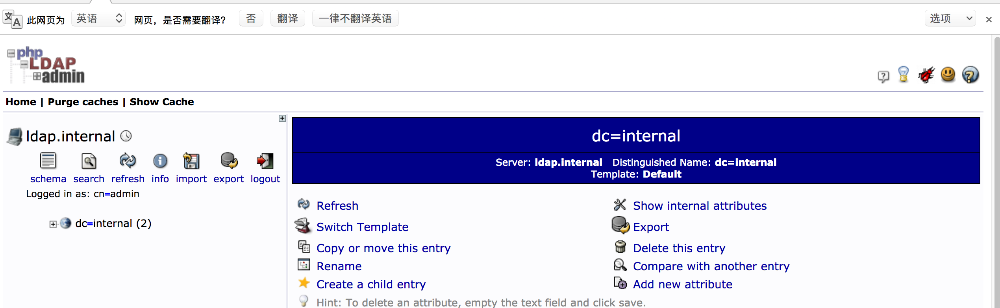

2. Create OU

- 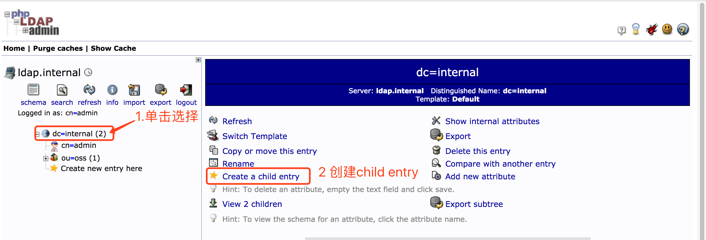

- 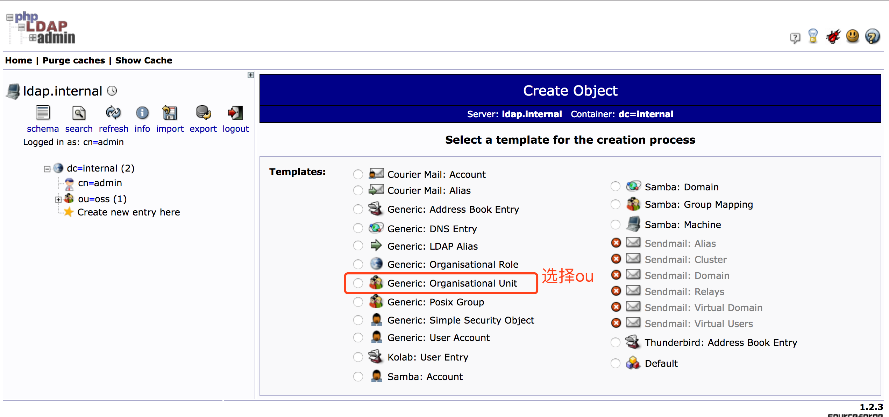

- 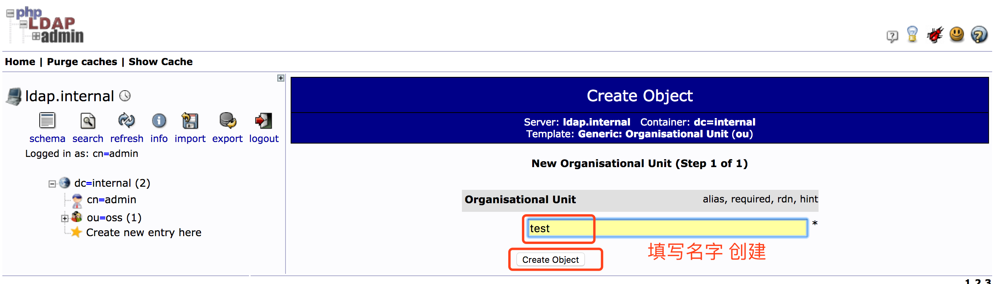

- 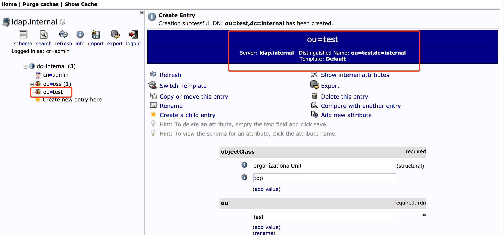

3. Create POSIX group

- 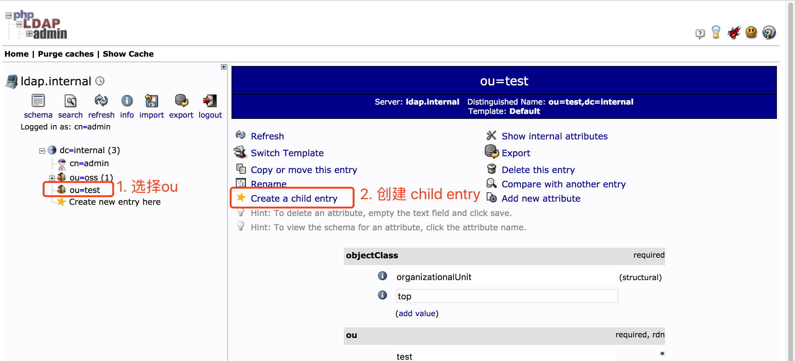

- 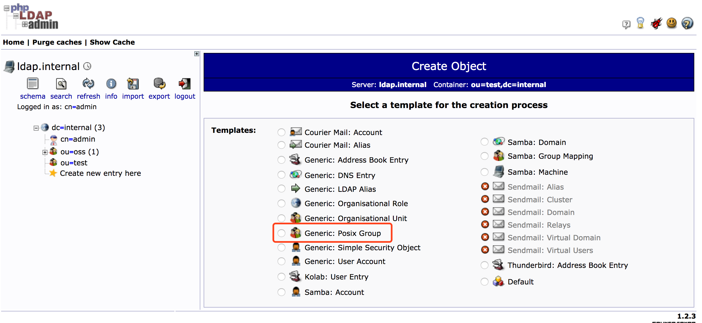

- 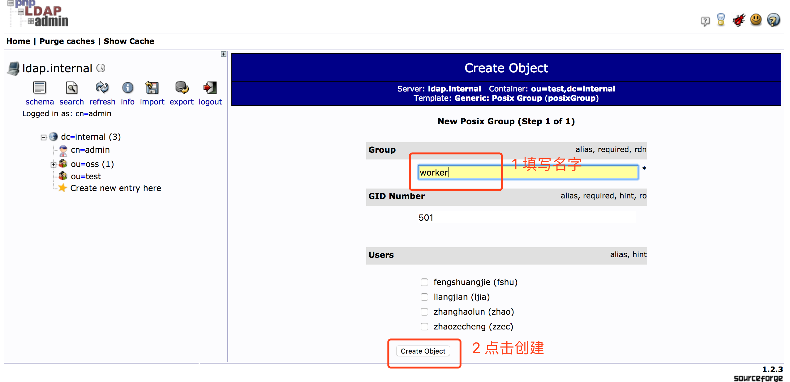

- 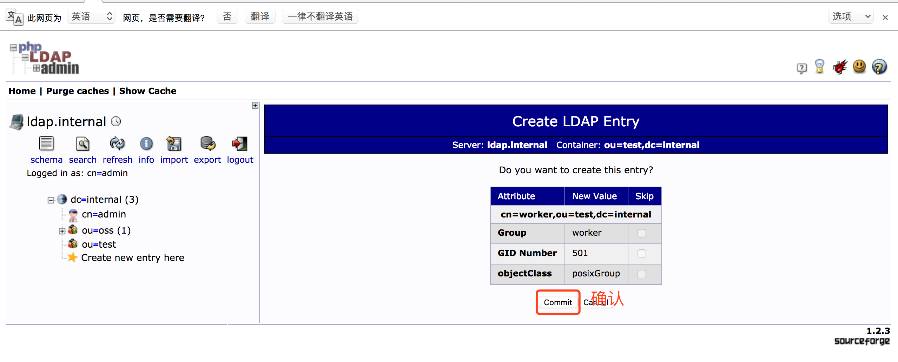

4. Create User

- 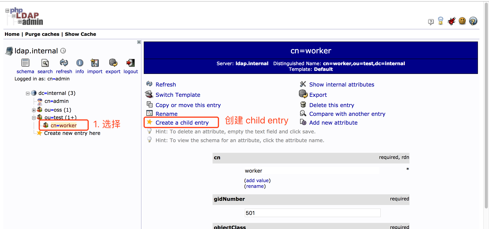

- 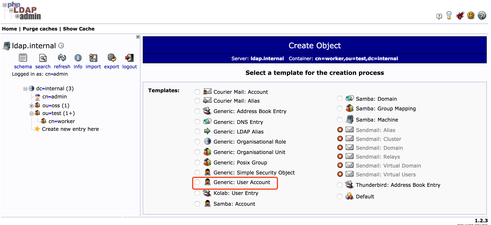

- 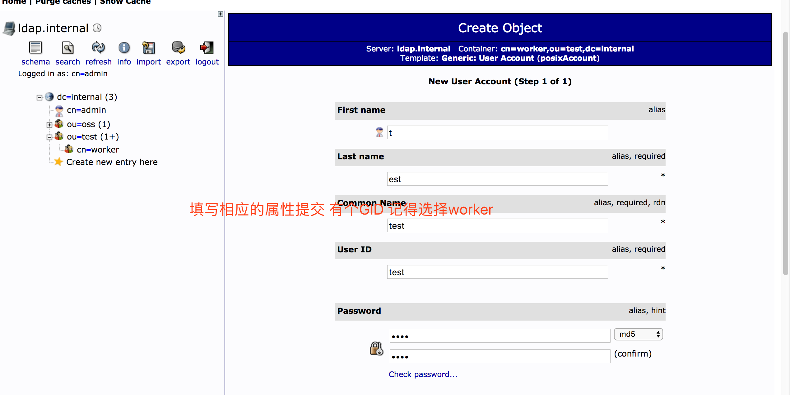

- 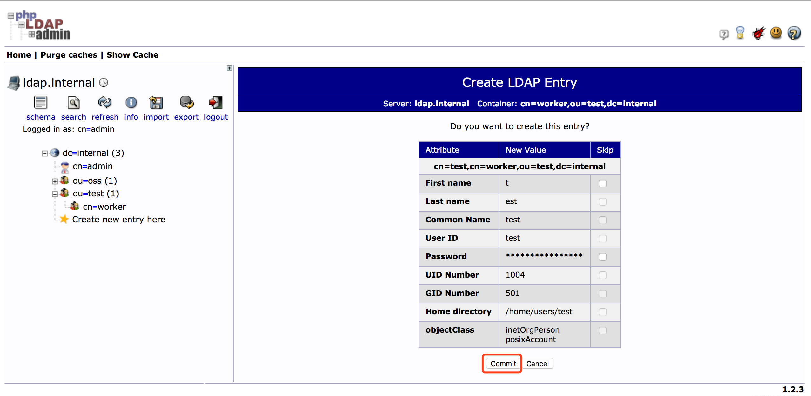

- 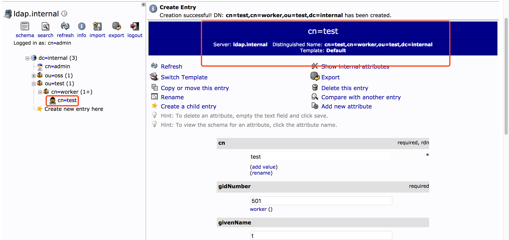
